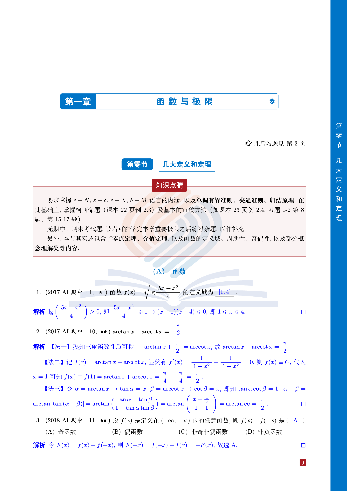

# USTBBook LaTeX 文档类

这是一个为北京科技大学设计的 LaTeX 文档类，用于排版书籍、教材等文档。

## 功能特性

- 专为北京科技大学设计的书籍排版样式
- 提供美观的章节和部分页面设计
- 包含自定义的页眉页脚样式
- 支持图片、表格、公式等学术排版需求

## 使用方法

1. 确保您的 TeX 发行版已正确安装（推荐使用 TeX Live 或 MiKTeX）

2. 项目包含一个示例文件：
- `test.tex`：基础示例文档

3. 编译您的文档，推荐使用 latexmk test.tex 以获得最佳效果

## 示例文件

您可以参考这些示例文件来了解如何使用该文档类.

## 文档效果展示

